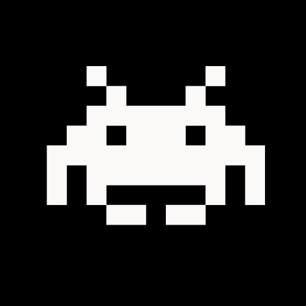
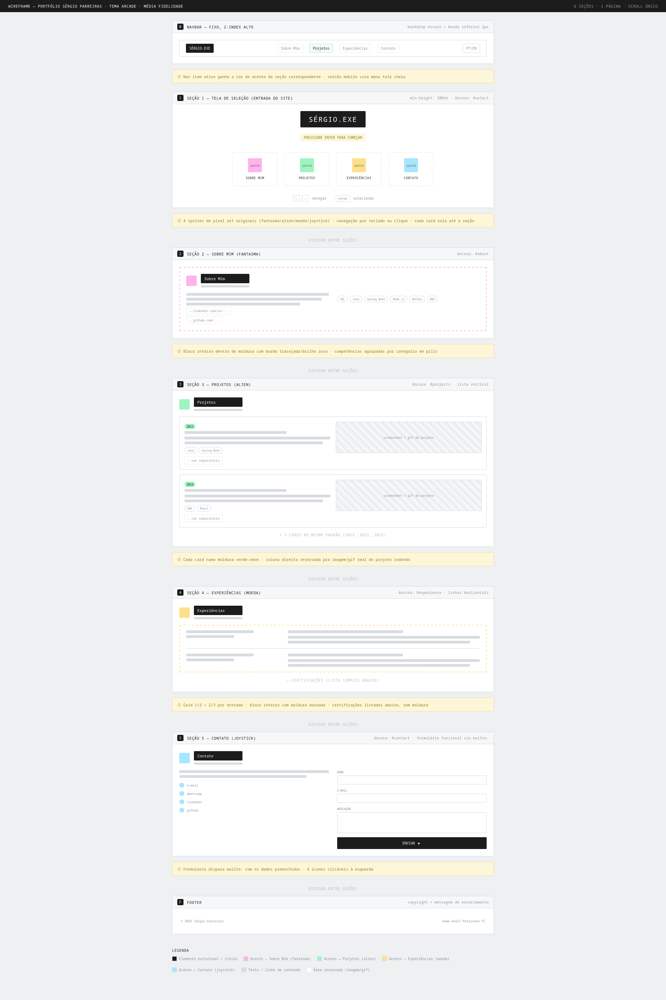
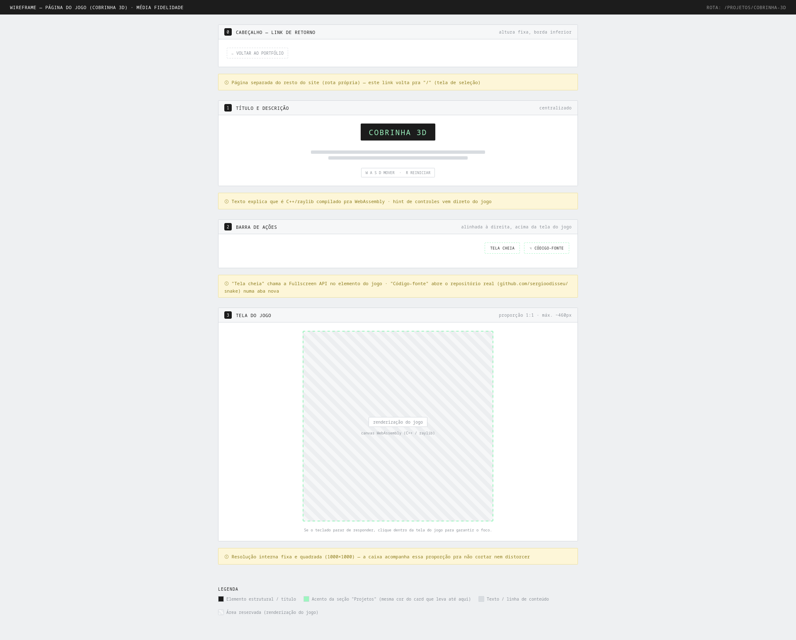

<div align="center">

# Portfólio Profissional — Sérgio Parreiras




</div>

**Instituição:** Pontifícia Universidade Católica de Minas Gerais (PUC Minas)
**Curso:** Engenharia de Software · **Disciplina:** Projeto de Software
**Professora:** Milena Menezes Adão · **Atividade:** Laboratório 1 — 2º Semestre/2026
**Aluno:** Sérgio Parreiras

**Repositório:** `TODO`
**Site publicado:** `TODO`

---

## Sobre o projeto

Portfólio pessoal com tema visual de fliperama (fundo escuro, sprites
em pixel art, tipografia pixelada). A página inicial funciona como
uma **tela de seleção**: quatro cartas — Sobre Mim, Projetos,
Experiências e Contato — cada uma com um sprite e uma cor próprios,
navegáveis pelo teclado (setas + Enter) ou por clique. Selecionar uma
rola suavemente até a seção correspondente, na mesma página.

- **Sobre Mim** *(sprite: fantasma)* — resumo profissional em PT/EN,
  competências agrupadas por categoria e idiomas.
- **Projetos** *(sprite: alien)* — linha do tempo com 6 projetos
  (2023–2025), cada um com imagem, descrição, stack e link do
  repositório. Um deles, a **Cobrinha 3D**, abre numa página própria
  dentro do site em vez de um link externo — ver seção
  [O jogo em C++/WebAssembly](#o-jogo-em-cwebassembly).
- **Experiências** *(sprite: moeda)* — FlowInsight (atual), PCX
  Tecnologia da Informação (estágio) e freelas via 99Freelas, com
  certificações (Red Hat, Cisco).
- **Contato** *(sprite: joystick)* — links diretos para e-mail,
  WhatsApp, LinkedIn e GitHub, e um formulário que **envia e-mail de
  verdade** através de um back-end próprio (ver
  [Back-end / API de contato](#back-end--api-de-contato)).

Diferente da maioria dos portfólios estáticos, este projeto tem duas
partes que rodam de verdade: um **servidor Node.js** (para o envio de
e-mail) e um **jogo em C++ compilado para WebAssembly** (embutido numa
página própria). Por isso o projeto inteiro roda dentro de um único
container Docker — ver [Rodando com Docker](#rodando-com-docker).

## Tecnologias

| Tecnologia | Uso neste projeto |
|---|---|
| **React 19** | Componentização da interface |
| **React Router DOM** | Duas rotas: o portfólio (`/`) e a página do jogo (`/projetos/cobrinha-3d`) |
| **Vite** | Servidor de desenvolvimento e build do front-end |
| **Tailwind CSS v4** | Estilização via utilitários, sobre tokens de cor próprios |
| **JavaScript (JSX)** | Linguagem do front-end — sem TypeScript nesta versão |
| **Node.js + Express** | Back-end: serve a API de contato e, em produção, o front-end e o jogo |
| **Nodemailer** | Envio de e-mail de verdade via SMTP (Gmail) |
| **C++ / raylib** | O jogo "Cobrinha 3D" |
| **Emscripten / WebAssembly** | Compila o jogo em C++ para rodar direto no navegador |
| **Docker / Docker Compose** | Empacota front-end, back-end e o build do jogo num único container |
| **Figma** | Wireframes de média fidelidade |
| **Render** | Hospedagem prevista (ver nota sobre a Vercel, abaixo) |

> **Nota sobre hospedagem:** este projeto **não pode ser hospedado na
> Vercel**. A Vercel é uma plataforma serverless/estática — ela não
> executa containers Docker nem processos de servidor de longa
> duração, e este projeto depende de um servidor Express rodando o
> tempo todo. Por isso a hospedagem escolhida foi uma plataforma com
> suporte nativo a Docker (Render).

## Design

Tema de fliperama: fundo quase preto, *scanlines* de CRT sobrepostas
à página inteira, e um sprite de pixel art **original** por seção —
não são reproduções de personagens de nenhum jogo específico.

| Seção | Sprite | Cor de acento |
|---|---|---|
| Sobre Mim | Fantasma | `#ff4dd8` |
| Projetos | Alien | `#00ff87` |
| Experiências | Moeda | `#ffcc00` |
| Contato | Joystick | `#4be8ff` |

Tipografia: **Press Start 2P** (pixelada) em títulos e rótulos,
**VT323** (monoespaçada, mais legível em bloco) no texto corrido.

## O jogo em C++/WebAssembly

O projeto "Cobrinha 3D" (`game/main.cpp`) é um Snake em 3D que roda na
superfície de um cubo, escrito em **C++** com a biblioteca gráfica
**[raylib](https://www.raylib.com/)**. Diferente dos outros projetos
do portfólio (que só linkam pro GitHub), este roda **dentro do
próprio site**, na página `/projetos/cobrinha-3d`.

Isso é possível graças ao **[Emscripten](https://emscripten.org/)**,
um compilador que transforma código C/C++ em **WebAssembly (Wasm)** —
um formato binário que os navegadores conseguem executar em velocidade
próxima da nativa, sem precisar instalar nada. Na prática, o mesmo
código C++ que rodaria como um executável no Windows/Linux é
compilado para essa página com o comando `em++` (o `g++` do
Emscripten), gerando um trio de arquivos:

- `index.wasm` — o código compilado de verdade;
- `index.js` — a "cola" em JavaScript que carrega o `.wasm` e conecta
  as chamadas gráficas do raylib ao `<canvas>` da página;
- `index.html` — a página que hospeda esse `<canvas>` (gerada a
  partir do template em `game/shell.html`).

Esses três arquivos são gerados automaticamente durante o build do
Docker (ver abaixo) e embutidos na página React através de um
`<iframe>`.

## Back-end / API de contato

O formulário da seção Contato não usa `mailto:` — ele envia a
mensagem de verdade, através de um back-end próprio em `server/`:

- **Express** expõe uma única rota, `POST /api/contact`, que valida
  os dados e usa o **Nodemailer** para enviar um e-mail via SMTP do
  Gmail (autenticado com uma *senha de app*, não a senha da conta).
- Em produção, esse mesmo servidor também serve os arquivos estáticos
  do front-end (`dist/`) e do jogo (`game/`) — front-end, back-end e
  jogo respondem todos pela mesma porta.
- Configuração detalhada (como gerar a senha de app do Gmail) em
  [`server/README.md`](server/README.md).

## Arquitetura do código

O projeto separa **conteúdo** (`data/`) de **apresentação**
(`components/`), com uma pasta `pages/` para as duas rotas do site:

```
portfolio-sergio/
├── Dockerfile                 # build completo: jogo (wasm) + front-end + servidor
├── docker-compose.yml
├── .dockerignore
│
├── game/                      # o jogo em C++
│   ├── main.cpp                 # código-fonte (raylib)
│   └── shell.html                # template HTML usado pelo Emscripten
│
├── server/                    # back-end Express
│   ├── index.js                  # rota /api/contact + serve o front-end/jogo em produção
│   ├── package.json
│   ├── .env.example               # modelo de configuração (copie para .env)
│   └── README.md                  # como gerar a senha de app do Gmail
│
├── docs/
│   └── img/                    # imagens usadas neste README (wireframes, etc.)
│
├── public/
│   ├── favicon.svg
│   └── projects/                # prints dos projetos, usados nos cards
│
└── src/
    ├── main.jsx                  # ponto de entrada + BrowserRouter
    ├── App.jsx                   # define as rotas do site
    ├── index.css                  # tokens de cor, fontes, animações
    │
    ├── pages/
    │   ├── PortfolioPage.jsx        # rota "/" — o site de scroll único
    │   └── SnakeGamePage.jsx        # rota "/projetos/cobrinha-3d" — embute o jogo
    │
    ├── data/                      # conteúdo do site, sem lógica visual
    │   ├── nav.js                   # itens do menu (reaproveita sprites.js)
    │   ├── sprites.js                # matrizes de pixel art + seção↔cor
    │   ├── profile.js               # nome, resumo, contatos, idiomas
    │   ├── skills.js                 # competências por categoria
    │   ├── projects.js               # projetos da timeline (imagem, stack, links)
    │   └── experience.js             # experiências e certificações
    │
    ├── hooks/
    │   └── useActiveSection.js      # detecta a seção visível para o menu
    │
    └── components/
        ├── Header.jsx                # menu fixo + versão mobile + PT/EN
        ├── ArcadeSelect.jsx           # tela de seleção (entrada do site)
        ├── PixelSprite.jsx            # renderiza um sprite a partir da matriz
        ├── Hero.jsx                   # seção "Sobre Mim"
        ├── Projects.jsx               # seção "Projetos"
        ├── ProjectItem.jsx            # item da timeline (imagem + nome-link)
        ├── Experience.jsx             # seção "Experiências"
        ├── ExperienceItem.jsx         # item de experiência
        ├── Contact.jsx                # seção "Contato"
        ├── ContactForm.jsx            # formulário (envia via API real)
        ├── ContactLink.jsx            # link de contato com ícone
        ├── Footer.jsx
        ├── icons/index.jsx            # ícones SVG usados no site
        └── ui/                        # peças reutilizáveis (Tag, Field, ...)
```

## Rodando com Docker

O `Dockerfile` monta tudo num único container, em três etapas:

1. **Compila o jogo** — usa a imagem oficial do Emscripten pra
   compilar o raylib para Web e depois o `main.cpp` em cima dele,
   gerando o `index.html`/`.js`/`.wasm` do jogo.
2. **Builda o front-end** — `npm run build` do React/Vite.
3. **Monta o servidor final** — copia o build do front-end e os
   arquivos do jogo para dentro do servidor Express, que passa a
   servir tudo (front-end, jogo e API de contato) na mesma porta.

```bash
cd server
cp .env.example .env
# edite o .env com seu GMAIL_USER e GMAIL_APP_PASSWORD

cd ..
docker compose up --build
```

Abre em `http://localhost:3001`. A primeira build demora bastante
(baixa e compila o raylib do zero — pode passar de 10 minutos); as
próximas usam cache do Docker e são bem mais rápidas.

## Instalação e execução local (sem Docker)

```bash
npm install
npm run dev       # http://localhost:5173

npm run build      # gera dist/
npm run preview    # serve a build localmente
```

O formulário de contato depende do back-end em `server/` pra
realmente enviar o e-mail:

```bash
cd server
npm install
npm run dev       # http://localhost:3001
```

Rodando assim (sem Docker), a rota do jogo (`/projetos/cobrinha-3d`)
abre normalmente, mas o jogo em si fica em branco — o WebAssembly só
existe depois de rodar `docker compose up --build` pelo menos uma
vez, porque é o Dockerfile que compila o C++.

## Wireframes

Protótipos de média fidelidade das telas principais do site.




